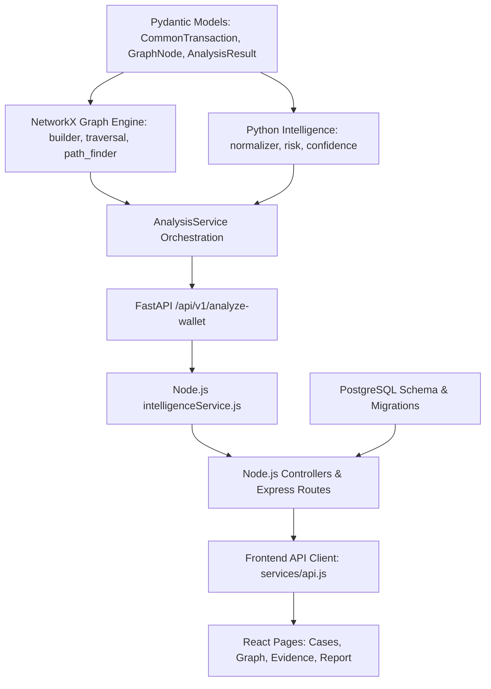

# TRACEVAULT V2 — COMPREHENSIVE ARCHITECTURAL AUDIT & REBUILD BLUEPRINT

**Project:** TRACEVAULT — Unified Financial Fraud Intelligence & Transaction Tracing Platform  
**Primary Problem Track:** Smart India Hackathon 2026 (SIH 26182 — Automated Blockchain Intelligence & VASP Attribution Engine)  
**Lead Software Architect & Principal Engineer:** AlphaX-Crypto  
**Audit Timestamp:** 2026-09-28  
**Document Status:** OFFICIAL BASELINE (Phase 0 Audit)

---

## 1. Current Architecture

TRACEVAULT is architected across three primary runtime tiers, an unpopulated database layer, and two distinct frontend codebases:

```
[ FRONTEND TIER ]
   ├── Trace-Vault/frontend (React 19 + Vite + React Router v7 + @xyflow/react)
   └── DemoDash/            (Parallel standalone UI prototype - React 19 + Vite)
            │  (REST / HTTP)
            ▼
[ APPLICATION BACKEND TIER ]
   └── Trace-Vault/backend  (Node.js 20 + Express 4.21)
       ├── Controllers: caseController, analysisController
       ├── Services: caseService (In-Memory Map), intelligenceService (Axios Client)
       └── Middleware: validation, securityScanMiddleware, errorHandler
            │  (Internal REST / HTTP :8000)
            ▼
[ INTELLIGENCE ENGINE TIER ]
   └── Trace-Vault/intelligence-engine (Python 3.11 + FastAPI + NetworkX)
       ├── Graph Engine: builder.py, traversal.py, path_finder.py
       ├── Intelligence Core: analysis_service.py, risk/scorer.py, attribution/confidence.py
       └── Adapters: MockBlockchainAdapter, MockGraphProvider
            │
            ▼
[ DATA / PERSISTENCE TIER ]
   └── Trace-Vault/database (PostgreSQL 15 - Currently 0 bytes / Unimplemented)
```

### Architectural Flow (Current State vs Target V2 Pipeline)
- **Current State:** The React frontend runs in complete client-side isolation using `localStorage` and `caseSession.js`. The Express backend communicates with the FastAPI service via `POST /api/v1/analyze-wallet`. However, the FastAPI service delegates graph operations to a naive BFS `MockGraphProvider` instead of the merged NetworkX graph engine. PostgreSQL is completely disconnected.
- **Target V2 Pipeline:** An end-to-end deterministic flow:
  $$\text{Frontend UI} \xrightarrow{\text{REST}} \text{Node Express} \xrightarrow{\text{REST}} \text{Python FastAPI} \xrightarrow{\text{Adapter}} \text{Normalizer} \xrightarrow{\text{Graph Builder}} \text{NetworkX DiGraph} \xrightarrow{\text{BFS \& PathFinder}} \text{VASP Attribution \& Risk Engine} \xrightarrow{\text{Canonical Result}} \text{PostgreSQL} \xrightarrow{} \text{Frontend Canvas}$$

---

## 2. Repository Structure & Branch Topography

```
SIH26182/
├── DemoDash/                              # Standalone React 19 investigation demo
│   ├── src/components/graph/              # @xyflow/react canvas, custom nodes, inspector
│   ├── src/components/evidence/           # Evidence locker tables and filter panels
│   ├── src/components/report/             # Court-ready report generator & legal notice modal
│   └── src/pages/                         # Dashboard, Cases, Graph, Attribution, Report
└── Trace-Vault/                           # Primary Monorepo
    ├── .env.example                       # Environment template
    ├── docker-compose.yml                 # Multi-container setup (node, python, postgres)
    ├── backend/                           # Node.js backend
    │   ├── src/app.js                     # Express app configuration
    │   ├── src/controllers/               # Case & Analysis controllers
    │   ├── src/services/                  # In-memory caseService & intelligenceService
    │   ├── src/middleware/                # Security scanner & regex validators
    │   └── tests/                         # Node test runner suite
    ├── intelligence-engine/               # Python intelligence microservice
    │   ├── app/main.py                    # FastAPI entrypoint
    │   ├── app/graph/                     # NetworkX engine (builder, traversal, path_finder)
    │   ├── app/attribution/               # VASP identifier & heuristic confidence
    │   ├── app/risk/                      # Rule-based multi-factor risk scorer
    │   ├── app/blockchain/                # Mock blockchain data & MockGraphProvider
    │   └── tests/unit/                    # Analysis unit test
    ├── database/                          # PostgreSQL schema, migrations, seeds (0 bytes)
    ├── docs/                              # Architecture, API contract, System design
    ├── frontend/                          # React application (working tree holds unstaged DemoDash diffs)
    └── tests/                             # Root E2E/integration tests (Empty)
```

### Git Branch Status
- `main` / `origin/main`: Scaffolding root commit (`994971b`).
- `origin/develop`: Integration branch containing PR #1 (`4cda545`), which merged Divija's NetworkX graph engine (`cf47b23`).
- `origin/feature/graph`: Divija's branch implementing `builder.py`, `traversal.py`, `path_finder.py`, `graph_models.py`.
- `origin/feature/intelligence`: Sam's branch implementing FastAPI endpoints, transaction normalizer, mock blockchain adapter, confidence engine, and risk scorer (`203db0a`, `3e9b205`).
- `origin/feature/backend`: Kushma's branch implementing Express core, validation, logging, intelligence integration client, and backend tests (`1d19978`, `ba61e53`).
- `origin/feature/frontend` (Current working checkout): Shiva's branch containing commit `9b459fa` plus unstaged overwrites porting `DemoDash/` into `frontend/`.
- `origin/feature/database`: Unpopulated (0 commits ahead of initial scaffolding).
- `origin/feature/testing`: Unpopulated (0 commits ahead of initial scaffolding).

---

## 3. Working Components (Preserve Without Unnecessary Rewrites)

1. **NetworkX Graph Engine (`intelligence-engine/app/graph/`):**
   - `TransactionGraphBuilder`: Assembles directed `networkx.DiGraph` instances, maintains address nodes, aggregates multi-transaction flows along directed edges, and tracks cumulative amounts.
   - `BFSTraverser`: Performs bounded BFS exploration up to $N$ hops, returning ordered traversal sequences, visited address sets, and distance maps. Contains `find_nearest_tagged_entity()` and `find_nearest_vasp()`.
   - `PathFinder`: Extracts deterministic shortest path node sequences and edge transfer metadata between source and destination nodes.
2. **Transaction Normalization (`intelligence-engine/app/normalization/`):**
   - Maps raw transaction objects into uniform schemas with standardized timestamps, decimal conversions, and directional flow attributes.
3. **Multi-Factor Risk Engine (`intelligence-engine/app/risk/`):**
   - Implements objective rule scoring: Mixer interaction (+30), Intermediary hop count (+10), Rapid movement / velocity (+10), Baseline investigative risk (+10). Maps totals into `LOW`, `MEDIUM`, `HIGH`, `CRITICAL`.
4. **Heuristic Confidence Engine (`intelligence-engine/app/attribution/confidence.py`):**
   - Computes attribution confidence starting at 90%, deducting 10% per hop distance and applying entity-specific penalties (e.g., -20% for mixer traversal).
5. **Backend Security & Validation Middleware (`backend/src/middleware/`):**
   - `securityScanMiddleware`: Deep regex scanner blocking requests containing Ethereum/Bitcoin private keys or 12/24-word BIP-39 mnemonic seed phrases.
   - `validation.js`: Strict validation of Ethereum address formats (`0x[a-fA-F0-9]{40}`), supported chains, and case ID schemas.
6. **Frontend Canvas & Investigation UI (`DemoDash/src/` & `frontend/src/`):**
   - React Flow visualizer (`@xyflow/react`) with custom SVG-styled nodes (`WalletNode`, `IntermediaryNode`, `ExchangeDepositNode`, `VaspNode`).
   - Interactive Node Inspector displaying balances, risk ratings, hop counts, and entity intelligence tags.
   - Evidence locker with multi-criteria filtering and detailed metadata panels.
   - Court-style printable investigation reports with formal Section 91 CrPC notice generation panels.

---

## 4. Broken Components

1. **PathFinder Model Import Failure in `develop`:**
   - In `develop`, `intelligence-engine/app/graph/path_finder.py` executes:
     ```python
     from app.models.analysis import PathEdge, PathNode, TracePath
     ```
   - However, `app/models/analysis.py` on `develop` is an empty 0-byte file. Running or importing `path_finder` on `develop` immediately throws an `ImportError`.
2. **AnalysisService Disconnect from NetworkX:**
   - In `feature/intelligence`, `AnalysisService.analyze_wallet()` imports `MockGraphProvider` from `app.blockchain.mock_graph` rather than the true NetworkX `TransactionGraphBuilder` from `app.graph.builder`.
3. **Missing `networkx` Dependency in Requirements:**
   - `intelligence-engine/requirements.txt` lists `fastapi`, `uvicorn`, `pydantic`, `httpx`, `pytest`, but omits `networkx`. A clean container build fails to import NetworkX.
4. **Broken Pydantic Version Pin:**
   - `requirements.txt` specifies `pydantic==1.10.12`, whereas modern FastAPI and Python 3.11 run Pydantic v2. `app/graph/graph_models.py` uses Pydantic Field definitions that require alignment.
5. **Frontend Service Stub:**
   - `frontend/src/services/api.js` is an incomplete 4-line stub that lacks methods for triggering analysis, fetching evidence, or generating disclosure documents.

---

## 5. Mock Components

1. **Mock Blockchain Adapters (`intelligence-engine/app/blockchain/mock.py`):**
   - In-memory mock transaction graph and entity directory (`BINANCE_HOT_WALLET`, `TORNADO_CASH_ROUTER`, `SUSPECT_1`, `INTERMEDIARY_1`, etc.).
2. **Mock Graph Provider (`intelligence-engine/app/blockchain/mock_graph.py`):**
   - Adjacency list dictionary implementing a naive queue BFS.
3. **In-Memory Backend Repository (`backend/src/services/caseService.js`):**
   - In-memory JavaScript `Map()` objects (`this.cases`, `this.results`, `this.disclosureRequests`).
4. **Client-Side Mock Investigation Session (`frontend/src/utils/caseSession.js` & `data/caseIntelligence.js`):**
   - Browser `localStorage` synthesizing fictional graph nodes, risk indicators, and evidence items via JavaScript functions.
5. **Mock Authentication (`frontend/src/utils/mockAuth.js`):**
   - Mock officer profile stored in browser cookies/localStorage without backend JWT validation.

---

## 6. Duplicate Components

1. **Repository-Level Duplication (`DemoDash/` vs `Trace-Vault/frontend/`):**
   - `DemoDash/` and `Trace-Vault/frontend/` duplicate identical React components (`TransactionGraph.jsx`, `NodeInspector.jsx`, `EvidenceTable.jsx`, `Report.jsx`, etc.).
2. **Dual Graph Traversal Logic:**
   - `app/blockchain/mock_graph.py` (`find_nearest_vasp`) duplicates the functionality of `app/graph/traversal.py` (`BFSTraverser.find_nearest_vasp`).
3. **Fragmented Entity & Case Models:**
   - Case data structures are defined independently in Node `caseService.js`, Python `models/analysis.py`, and React `mockData.js`.

---

## 7. API Mismatches

1. **Path Representation Inconsistency:**
   - **Contract Specification (`docs/api/API_CONTRACT.md`):** Array of edge objects `[{"from": "...", "to": "...", "transaction_hash": "..."}]`.
   - **Python Service (`feature/intelligence`):** Returns `path: List[str]` (plain address strings: `["0x1", "0x2"]`).
   - **NetworkX Pathfinder (`app/graph/path_finder.py`):** Returns `TracePath` with `nodes: List[PathNode]` and `edges: List[PathEdge]`.
   - **Frontend UI (`DemoDash` / `caseIntelligence.js`):** Expects nodes: `[{id, label, role, address, hop, amount}]`.
2. **Evidence Schema Inconsistency:**
   - **Python Service:** Returns `evidence: List[str]` (plain text strings).
   - **Frontend UI:** Expects rich structured objects: `[{id, type, description, entity, source, status, timestamp, metadata}]`.
3. **Endpoint Signature Inconsistency:**
   - Backend routes: `POST /api/cases/:id/analyze`, payload: `{"blockchain": "ethereum", "wallet_address": "0x..."}`.
   - Frontend API client: Only defines `getCases()`, `getCase(id)`, `createCase(payload)`. The UI never calls `/analyze`.

---

## 8. Data-Model Mismatches

| Field | Node.js Backend API | Python Intelligence Engine | React Frontend (`caseSession`) |
|---|---|---|---|
| **Case ID** | `case_id` (`CASE-MMDD-XXX`) | `case_id` | `id` (`TV-2026-041`) |
| **Case Title** | `title` | N/A | `name` |
| **Risk Score** | Inside `results[0].risk.score` | `score: int` (0-100) | `riskScore: number` |
| **Risk Level** | Inside `results[0].risk.level` | `level: str` (`HIGH`) | `riskLevel: string` |
| **VASP Name** | `nearest_vasp.name` | `name: str` | `vasp: string` |
| **Attribution Confidence** | `nearest_vasp.confidence` | `confidence: int` | `confidence: number` |
| **Path Data** | Raw JSON array | Array of strings | Node array with UI roles |

---

## 9. Database Status

- **Status:** **UNIMPLEMENTED (0% Complete)**.
- [`Trace-Vault/database/`](file:///c:/Users/Samarth/OneDrive/Desktop/SIH26182/Trace-Vault/database) contains only a 0-byte `README.md`.
- No schema definitions (`CREATE TABLE`), migrations, or seeds exist.
- Backend `package.json` lacks database driver dependencies (`pg`, `knex`, `prisma`, etc.).
- All backend state resides in transient process memory.

---

## 10. Frontend Status

- **UI / Visual Layer:** **90% Complete (LEA-Grade)**.
- **Backend Connectivity:** **0% Connected (Pure LocalStorage)**.
- Features high-quality dark slate theme, `@xyflow/react` transaction graph, Node Inspector, step-by-step progress indicator, evidence table, and print-ready Section 91 CrPC notice generator.
- All investigation workflows run locally inside `localStorage` via `caseSession.js`.

---

## 11. Intelligence Engine Status

- **Graph Algorithms:** **85% Complete (NetworkX Engine)**.
- **Service Integration:** **50% Complete**.
- FastAPI application runs and responds to `/health`.
- `AnalysisService` works in a unit-test sandbox, but relies on `MockGraphProvider` instead of the merged NetworkX engine.
- Missing live blockchain data fetchers.

---

## 12. Backend Status

- **API Architecture:** **70% Complete (Express Core)**.
- **Persistence:** **0% Complete (In-Memory Map)**.
- Features request validation, private key security scanner, structured logging, and Axios proxy to Python.
- Missing real database queries and persistent case storage.

---

## 13. Security Gaps

1. **Missing Authentication & RBAC:** Express routes have no token verification. Anyone can create cases or trigger analyses.
2. **Unrestricted CORS:** Allows wildcard origins in development mode.
3. **Missing HTTP Security Headers:** Express application does not use `helmet` or CSP headers.
4. **Missing Rate Limiting:** Traversal endpoints lack rate limits, creating denial-of-service risks through heavy graph traversals.
5. **No Audit Trail:** Officer actions (viewing cases, exporting evidence) are not recorded in an immutable audit table.

---

## 14. Testing Gaps

1. **Root Integration Tests:** [`Trace-Vault/tests/`](file:///c:/Users/Samarth/OneDrive/Desktop/SIH26182/Trace-Vault/tests) is completely empty.
2. **Graph Engine Tests:** No dedicated test file tests `builder.py`, `traversal.py`, or `path_finder.py`.
3. **Frontend Automated Tests:** Zero test coverage for UI components, graph rendering, or report export.
4. **Full Pipeline E2E Test:** No automated test executes the complete chain from Case Creation $\rightarrow$ Backend $\rightarrow$ FastAPI $\rightarrow$ NetworkX $\rightarrow$ Frontend.

---

## 15. Technical Debt

1. **Git Branch Fragmentation:** Multiple unmerged branches with overlapping responsibilities.
2. **Stale/Dirty Working Directory:** Unstaged files in `Trace-Vault/frontend/`.
3. **Dual Workspace:** Parallel existence of `DemoDash/` outside the primary repository.
4. **Decentralized Mock Data:** Fictional entities are defined in 4 separate locations across Python, Node, and JavaScript.

---

## 16. Dependency Graph



---

## 17. Recommended Implementation Order (Phased)

1. **Phase 1: Canonical Data Contract:**
   - Unify and define stable Pydantic models in `intelligence-engine/app/models/` for transactions, graph elements, path elements, VASP attribution, risk signals, structured evidence, and the canonical `AnalysisResult`.
2. **Phase 2: NetworkX Intelligence Engine Integration:**
   - Wire `builder.py`, `traversal.py`, and `path_finder.py` directly into `AnalysisService`. Remove `MockGraphProvider`.
   - Add unit tests for the graph engine.
3. **Phase 3: VASP Attribution & Explainable Risk Engine:**
   - Refactor attribution to return structured entities and clear heuristic confidence.
   - Refactor risk engine to emit modular `RiskSignal` objects with investigative rationale.
4. **Phase 4: Node.js Backend Alignment:**
   - Synchronize Express controllers and validation middleware with the canonical `AnalysisResult` contract.
5. **Phase 5: PostgreSQL Database Persistence:**
   - Create migrations and schema in `database/migrations/` (`cases`, `wallets`, `entities`, `evidence`, `audit_logs`).
   - Replace in-memory `Map()` in `caseService.js` with PostgreSQL database persistence.
6. **Phase 6: Frontend Integration:**
   - Consolidate `DemoDash` into `Trace-Vault/frontend/`.
   - Implement complete `services/api.js` client and wire all pages to live backend endpoints.
7. **Phase 7: Security, RBAC & LEA Audit Trail:**
   - Implement JWT authentication, role guards (`INVESTIGATOR`, `SUPERVISOR`, `ADMIN`), rate limiting, and audit logging.
8. **Phase 8: End-to-End Testing & Verification:**
   - Implement automated E2E test verifying the full pipeline against controlled test topologies.

---

## 18. Architectural Risks

1. **Graph Combinatorial Explosion:** High-degree wallet addresses (e.g., hot wallets with 100,000+ transfers) can exhaust memory if traversal is unconstrained.  
   *Mitigation:* Enforce strict max-hop ($N \le 5$) and edge-per-node caps ($M \le 100$) during traversal.
2. **Schema Incompatibility During Migration:** Changing the Python response format could break frontend visualization components.  
   *Mitigation:* Establish the Canonical Data Contract in Phase 1 before updating services or UI components.
3. **Loss of Prototype UI Details:** Migrating from `DemoDash` to `Trace-Vault/frontend` risks dropping custom CSS or graph node components.  
   *Mitigation:* Preserve existing `@xyflow/react` custom nodes and styles intact; replace only the data ingestion layer (`caseSession.js`).

---

## 19. Migration Strategy

1. **Preserve First:** Lock existing working modules (`app/graph/`, custom React nodes, Express validation).
2. **Single Canonical Contract:** Establish `CommonTransaction`, `GraphNode`, `GraphEdge`, `TracePath`, `EvidenceItem`, and `AnalysisResult` as the universal language across all layers.
3. **Bottom-Up Pipeline Rebuild:** Update Python models $\rightarrow$ Graph Engine $\rightarrow$ Analysis Service $\rightarrow$ Express Backend $\rightarrow$ React UI.
4. **No Silent Mocking:** Tag all mock data explicitly in response metadata (`source: "CONTROLLED_MOCK_DATASET"`).

---

## 20. Exact Files to be Modified in Phase 1 (Canonical Data Contract)

In Phase 1, the following files will be created or updated to establish the canonical data contracts across the Python intelligence service and documentation:

1. `Trace-Vault/intelligence-engine/app/models/transaction.py` — Establish `CommonTransaction` model.
2. `Trace-Vault/intelligence-engine/app/models/entity.py` — Update `EntityType` enum and `Entity` model.
3. `Trace-Vault/intelligence-engine/app/models/analysis.py` — Implement canonical `PathNode`, `PathEdge`, `TracePath`, `VaspAttribution`, `RiskSignal`, `RiskResult`, `EvidenceItem`, `AnalyzeWalletRequest`, and `AnalysisResult`.
4. `Trace-Vault/intelligence-engine/app/graph/graph_models.py` — Align `GraphNode` and `GraphEdge` with `CommonTransaction` and canonical models.
5. `Trace-Vault/intelligence-engine/requirements.txt` — Add `networkx>=3.0` and update dependencies.
6. `Trace-Vault/docs/api/API_CONTRACT.md` — Document canonical V2 request and response contracts.
7. `Trace-Vault/docs/api/DATA_MODELS.md` — Formalize entity, transaction, and evidence schemas.

---

*End of TRACEVAULT_V2_AUDIT.md. No code modifications beyond this audit document will be performed until Phase 1 approval is granted.*
