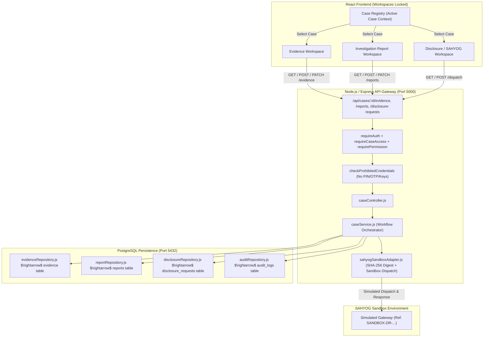

# TRACEVAULT — SPRINT 16 REPORT
## Evidence → Report → Authorized Disclosure Integration

**Date:** 2026-10-04  
**Sprint Status:** COMPLETE & VERIFIED  
**Architecture Layer:** React Workspaces $\leftrightarrow$ Node.js/Express API Gateway $\leftrightarrow$ PostgreSQL Persistence $\leftrightarrow$ SAHYOG Sandbox Adapter  

---

### 1. Executive Summary

Sprint 16 integrates the entire upstream analytical pipeline (**Transactions $\rightarrow$ Graph $\rightarrow$ Risk $\rightarrow$ UPI $\rightarrow$ VASP $\rightarrow$ Geospatial**) into the primary investigative deliverable workflows:
1. **Evidence Register**: Authoritative evidentiary tracking with explicit `OBSERVED_FACT` vs `DERIVED` classification.
2. **Investigation Report**: Dossier compiling executive summaries, structured evidence schedules, analytical findings, investigator interpretations, and a cryptographic `Payload Integrity Digest` (SHA-256).
3. **Authorized Disclosure Request**: Law enforcement requisition drafting targeting candidate VASPs/entities under statutory authority (`Section 91 CrPC`), backed by the `MockSahyogAdapter`.
4. **SAHYOG Sandbox Adapter**: Simulated dispatch and response acknowledgment with strict sandbox disclaimers (`SANDBOX-DR-...`), telemetry tracking, and application audit trails.

All sprint requirements, forensic neutrality constraints, and security validations have been satisfied:
- **No live government or banking portal connections**: Requisition dispatch runs strictly in a sandbox simulation environment.
- **Forensic neutrality preserved**: No claims of "court-ready", "immutable proof", or "wallet owner". SHA-256 digests are strictly labeled `Payload Integrity Digest`.
- **Prohibited credentials rejected**: Input sanitization prevents storage or transmission of private keys, seed phrases, PINs, or passwords.
- **End-to-end case isolation**: Multi-case access controls guarantee that evidence, reports, and disclosure requisitions remain partitioned.
- **Frontend workspaces locked**: No visual system or layout alterations were introduced. Active case context now prop-drives `EvidenceWorkspace`, `ReportWorkspace`, and `DisclosureWorkspace`.

---

### 2. Architecture & Data Flow

---

### 3. API Contract & Endpoint Specifications

#### 3.1. Evidence Endpoints
- **`GET /api/cases/:id/evidence`**
  - **Permissions:** `EVIDENCE_VIEW`
  - Returns list of evidence records linked to the case, including `OBSERVED_FACT` and `DERIVED` classifications.
- **`POST /api/cases/:id/evidence`**
  - **Permissions:** `requireCaseAccess`
  - Ingests new forensic evidence row with provenance source and metadata. Rejects prohibited credentials (`private_key`, `seed_phrase`, etc.).
- **`GET /api/cases/:id/evidence/:evidenceId`**
  - **Permissions:** `EVIDENCE_VIEW`
  - Fetches specific evidence item; enforces case isolation (returns 404 if item does not belong to case).
- **`PATCH /api/cases/:id/evidence/:evidenceId`**
  - **Permissions:** `requireCaseAccess`
  - Updates review status (`AVAILABLE`, `REVIEW REQUIRED`, `REVIEWED`, `INSUFFICIENT SUPPORT`, `DISPUTED`) and attaches investigator notes.

#### 3.2. Investigation Report Endpoints
- **`GET /api/cases/:id/reports`**
  - **Permissions:** `REPORTS_VIEW`
  - Lists historical report records for the case.
- **`POST /api/cases/:id/reports`**
  - **Permissions:** `requireCaseAccess`
  - Compiles structured report incorporating evidence schedule, risk scores, threat level, investigator interpretations, and a 64-character SHA-256 `payload_integrity_digest`.
- **`GET /api/cases/:id/reports/:reportId`**
  - **Permissions:** `REPORTS_VIEW`
  - Fetches report by ID with case isolation checks.
- **`PATCH /api/cases/:id/reports/:reportId`**
  - **Permissions:** `requireCaseAccess`
  - Updates lifecycle status (`DRAFT`, `UNDER REVIEW`, `READY FOR REVIEW`).

#### 3.3. Disclosure & SAHYOG Sandbox Endpoints
- **`POST /api/cases/:id/disclosure-request`**
  - **Permissions:** `DISCLOSURE_CREATE`
  - Drafts an authorized disclosure request targeting candidate VASP/entity with legal basis disclaimer and SHA-256 payload integrity digest.
- **`GET /api/cases/:id/disclosure-requests`**
  - **Permissions:** `requireCaseAccess`
  - Returns list of disclosure requisitions for the case.
- **`GET /api/cases/:id/disclosure-requests/:requestId`**
  - **Permissions:** `requireCaseAccess`
  - Returns single disclosure requisition record.
- **`POST /api/cases/:id/disclosure-requests/:requestId/dispatch`**
  - **Permissions:** `DISCLOSURE_CREATE`
  - Dispatches requisition to the SAHYOG Sandbox (`action: "SUBMIT"`) or simulates recipient acknowledgment (`action: "SIMULATE_RESPONSE"`). Returns `SANDBOX-DR-...` reference and simulation disclaimers.

---

### 4. Forensic Neutrality & Classification Standard

1. **Classification Standard**:
   - `OBSERVED_FACT`: On-chain transfer, transaction hash, block timestamp, UPI reference, ledger amount.
   - `SYSTEM_ANALYSIS`: NetworkX peeling chain traversal, high-velocity burst heuristic.
   - `ATTRIBUTION_INDICATOR`: Potential VASP association, deposit cluster proximity.
   - `RISK_INDICATOR`: Structuring score, mixer exposure heuristic.
   - `INVESTIGATOR_INTERPRETATION`: Professional commentary entered by the investigating officer.

2. **Language Guarantees**:
   - The term "court-ready evidence" is strictly replaced by **"Investigation Report"** and **"Supporting Evidence Record"**.
   - Target relationships are documented as **"Candidate VASP Association"**.
   - Cryptographic hashes are titled **"Payload Integrity Digest"**, without claims of legal finality or chain-of-custody immutability.
   - SAHYOG interactions carry explicit disclaimers: `"SAHYOG SANDBOX / SIMULATED DISPATCH. No real regulatory filing or external VASP communication has taken place."`

---

### 5. Verification & Test Coverage

| Test Suite | Total Tests | Passed | Failed | Status |
| :--- | :---: | :---: | :---: | :---: |
| **Node.js Backend Tests (`backend/tests/`)** | 149 | 149 | 0 | **PASS** |
| - *Sprint 16 Specific (`sprint16_evidence_report_disclosure.test.js`)* | 15 | 15 | 0 | **PASS** |
| - *Sprint 15 Specific (`sprint15_vasp_geo_integration.test.js`)* | 15 | 15 | 0 | **PASS** |
| - *Sprint 14 Specific (`sprint14_risk_upi_integration.test.js`)* | 16 | 16 | 0 | **PASS** |
| - *Sprint 13 Specific (`sprint13_graph_intelligence.test.js`)* | 12 | 12 | 0 | **PASS** |
| - *Sprint 12 Specific (`sprint12_transaction_ingestion.test.js`)* | 14 | 14 | 0 | **PASS** |
| - *Sprint 11 Specific (`sprint11_persistence_integration.test.js`)* | 10 | 10 | 0 | **PASS** |
| **Python Intelligence Engine (`pytest`)** | 217 | 217 | 0 | **PASS** |
| **Database Migrations & Constraints (`validate_db.js`)** | 18 migrations | 18 | 0 | **PASS** |
| **Frontend Production Build (`npm run build`)** | TypeScript + Vite | OK | 0 | **PASS** |

---

### 6. Audit Logging Verification

Every workflow event triggers an append-only entry in the `audit_logs` table:
- `CASE_CREATED`: Logged when an investigation case is initialized.
- `EVIDENCE_CREATED`: Logged when evidence is linked or added to a case.
- `EVIDENCE_STATUS_CHANGED`: Logged upon review/dispute status transitions.
- `REPORT_CREATED`: Logged with SHA-256 digest when a report is compiled.
- `REPORT_UPDATED`: Logged when report status transitions occur.
- `DISCLOSURE_REQUEST_CREATED`: Logged when a requisition is drafted.
- `DISCLOSURE_SUBMITTED_SANDBOX`: Logged when dispatched to the simulated SAHYOG adapter.
- `DISCLOSURE_RESPONSE_SIMULATED`: Logged when recipient acknowledgment telemetry is recorded.
