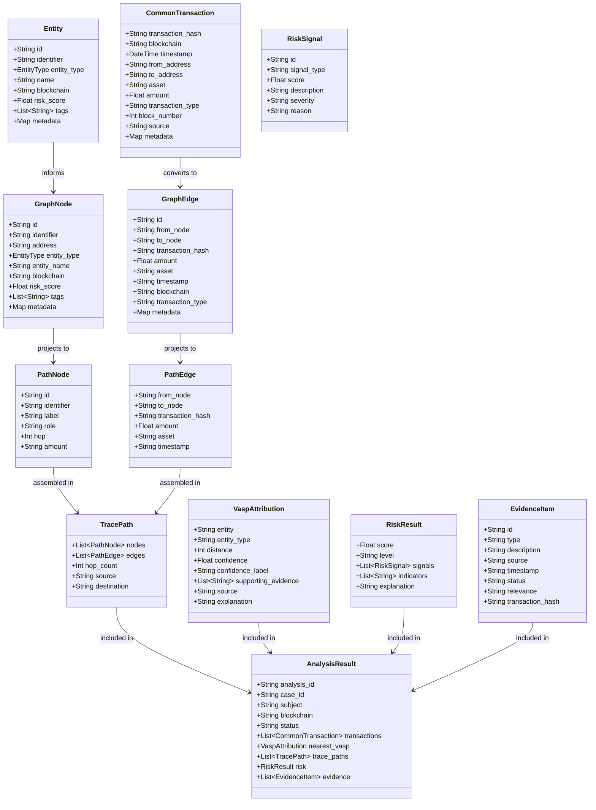

# TRACEVAULT V2 — Canonical Data Models Specification

**Specification Version:** 2.0.0  
**Status:** CANONICAL BASELINE (Phase 1)  
**Package:** `app.models` & `app.graph.graph_models`

---

## 1. Domain Model Overview

TRACEVAULT V2 separates raw data ingestion from investigative intelligence by establishing a unified **Common Intelligence Core**. All external data sources (blockchain RPCs, ledger explorers, mock datasets, and future banking/UPI feeds) are normalized into the **Canonical Data Models**.



---

## 2. Core Transaction Model

### `CommonTransaction`
Located at `app.models.transaction.CommonTransaction`.  
Normalizes raw on-chain transaction logs and transfer events into a standardized directional edge.

```python
class CommonTransaction(BaseModel):
    transaction_hash: str     # Unique transaction hash or reference (UTR, RRN)
    blockchain: str           # "ethereum", "bitcoin", "polygon", etc.
    timestamp: datetime | str # ISO 8601 UTC timestamp
    from_address: str         # Originating wallet or account
    to_address: str           # Destination wallet or account
    asset: str                # Asset symbol (ETH, BTC, USDT)
    amount: float             # Standard floating point volume
    transaction_type: str     # "transfer", "contract_call", "mint", "burn"
    block_number: int | None  # Block height
    source: str               # Ingestion adapter ("ethereum_rpc", "mock")
    metadata: dict            # Extensible attributes (gas, logs, memo)
```

---

## 3. Entity & Graph Models

### `EntityType` & `Entity`
Located at `app.models.entity`.  
Distinguishes cryptographic identifiers (addresses) from known organizational entities (VASPs, exchanges, mixers) without making unverified assumptions about real-world personal identity.

- **`EntityType` Values:**
  - `WALLET`: Unidentified standard unhosted wallet.
  - `VASP`: Virtual Asset Service Provider (regulated entity).
  - `EXCHANGE`: Centralized cryptocurrency exchange.
  - `DEPOSIT_WALLET`: Tagged exchange deposit hot wallet.
  - `MIXER`: Anonymization protocol (e.g. Tornado Cash).
  - `INTERMEDIARY`: Forwarding or peeling wallet.
  - `MERCHANT`: Commercial payment processor.
  - `MULE_ACCOUNT`: Flagged high-velocity aggregator (crypto or banking).
  - `SMART_CONTRACT`: Autonomous protocol or token contract.
  - `UNKNOWN`: Unclassified address.

### `GraphNode` & `GraphEdge`
Located at `app.graph.graph_models`.  
Direct representation of vertices and directed edges in the `networkx.DiGraph`.
- **`GraphNode`:** Tracks address, entity type, entity name, calculated risk score, tags, and metadata. Provides bidirectional compatibility between `identifier` and `address`.
- **`GraphEdge`:** Directed transfer tracking `from_node`, `to_node`, `transaction_hash`, `amount`, `asset`, `timestamp`, and cumulative flow weight.

---

## 4. Path & Traversal Models

### `PathNode` & `PathEdge`
Located at `app.models.analysis`.  
Extracted sequence along a traversal path from subject to target:
- **`PathNode`:** Holds `identifier`, `address`, `label`, `role` (e.g. "Suspect Wallet", "Forwarding wallet"), `hop` distance, and formatted transfer amount.
- **`PathEdge`:** Directed step holding `from_node`, `to_node`, `transaction_hash`, `amount`, `asset`, and `timestamp`.

### `TracePath`
Container holding:
- `nodes`: Ordered `List[PathNode]` starting from hop 0 (subject) to hop $N$ (destination).
- `edges`: Ordered `List[PathEdge]`.
- `hop_count`: Integer length of path.
- `source`: Origin address.
- `destination`: Terminating entity address.

---

## 5. Attribution & Risk Models

### `VaspAttribution`
Located at `app.models.analysis.VaspAttribution`.  
Represents a potential association between the fund trail and a Virtual Asset Service Provider.
- **Attributes:**
  - `entity`: Known exchange/VASP name (e.g., "Binance", "CoinDCX").
  - `distance`: Shortest hop distance from subject.
  - `confidence`: Heuristic rating (0–100%) calculated as:
    $$\text{Confidence} = \text{Base}(90) - (\text{Distance} \times 10) - \text{EntityPenalties}$$
  - `confidence_label`: `"High confidence"` ($\ge 70$), `"Moderate confidence"` ($40-69$), or `"Low confidence"` ($< 40$).
  - `supporting_evidence`: Rationale describing why attribution was made.
  - `source`: Origin dataset or intelligence heuristic.

### `RiskSignal` & `RiskResult`
Located at `app.models.analysis`.  
Provides modular, explainable risk indicators:
- **`RiskSignal`:** Atomic signal evaluation (e.g. `MIXER_EXPOSURE`, contribution: +30, severity: `HIGH`, reason: "Direct link to mixing service").
- **`RiskResult`:** Aggregated score ($0-100$), calibrated risk tier (`LOW`, `MEDIUM`, `HIGH`, `CRITICAL`), list of `RiskSignal` objects, and plain-language summary for court dossiers.

---

## 6. Evidentiary & Response Models

### `EvidenceItem`
Located at `app.models.analysis.EvidenceItem`.  
First-class object maintaining chain-of-custody data:
- `id`: Unique identifier (e.g. `EV-001`).
- `type`: `TRANSACTION`, `WALLET`, `PATH`, `ATTRIBUTION`, `RISK`.
- `description`: Plain-language explanation of observed finding.
- `source`: Verifiable ledger or dataset origin.
- `timestamp`: UTC ISO 8601 timestamp.
- `status`: `Verified`, `Supporting`, `Needs Review`, `Detected`.
- `relevance`: `CRITICAL`, `HIGH`, `MEDIUM`, `LOW`.
- `transaction_hash`, `block_number`, `from_address`, `to_address`, `amount`, `asset`, `entity`.

### `AnalysisResult`
Located at `app.models.analysis.AnalysisResult`.  
The single canonical investigation response returned by the Python Intelligence Engine and consumed by Node.js and React:
- Combines normalized transactions, graph visualization nodes/edges, nearest VASP attribution, trace paths, risk score and signals, confidence metrics, and structured evidence items.
